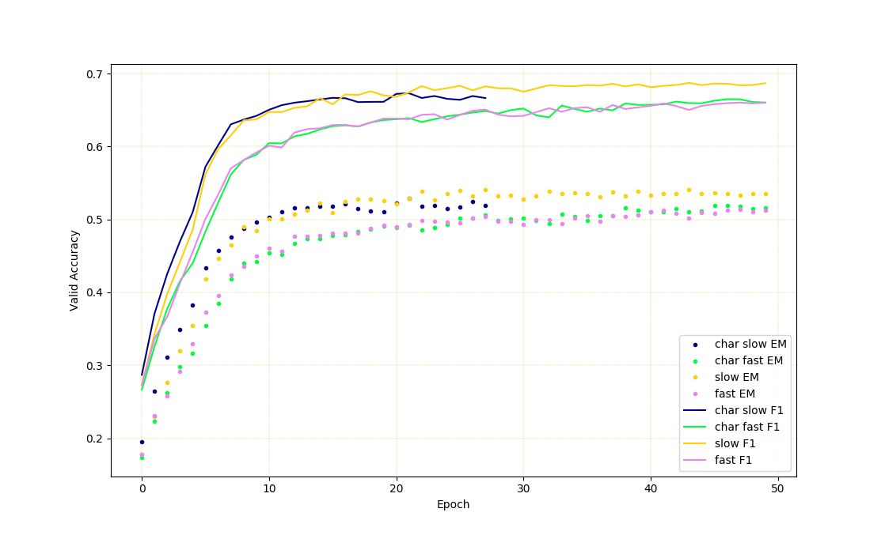

# A Pytorch Implementation of MatchLSTM for SQuAD
--------------------------------------------------------------------------------
A simple pytorch implementation of MatchLSTM (Wang and Jiang, 2016) model for SQuAD (Rajpurkar et al., 2016) question answering. Note that the model config used in this implementation might be different with what in the paper. 

## Tokenized SQuAD
An NLTK tokenized version of SQuAD dataset is included. Because the original test set is hidden, I split a subset from training split as "valid" set, and use the original dev set as test set. the splitting is on Wikipedia article level.

## Requirements
* Python 2.7
* Install Pytorch, follow [this][pytorch_install].
* Download pretrained GloVe embeddings from [here][glove_download].
* Run `pip install --requirement requirements.txt`

## First Time Running
* Run `python helpers/embedding_2_h5.py` to generate glove embedding h5 file.
* It will take some time when first time running because it will generate an h5 file for SQuAD dataset

## Results
* In the following experiments, 300d GloVe embeddings pretrained on 840B tokens are used.
* The default using LSTM is not the pytorch built-in version, it is slower version but with layernorm (Ba et al., 2016) and dropout (Kingma et al., 2015) support. Enable `fast_rnn` to use the pytorch built-in LSTM, instead.
* Character level embedding doesn't seem to help in this specific model, and makes it slower, to use char level embeddings, enable `char_level`.
* The following results are got from single Nvidia P40 GPUs. If you have less GPU memory, use smaller batch size.
* Other things implemented but haven't done ablation test yet, like highway connection (Srivastava et al., 2015) between each layers. (TODO)

| config | valid f1 | valid em | dev f1 | dev em | param amount |
| --- | --- | --- | --- | --- | --- |
| default config | **0.68714** | **0.54033** | **0.73007** | **0.62091** | 1950002 |
| enable fast_rnn | 0.66019 | 0.51396 | 0.71294 | 0.59972 | 1945802 |
| enable char_level(still running) | 0.66670 | 0.51764 | 0.71956 | 0.61107 | 2143922 |
| enable char + fast | 0.66481 | 0.51900 | 0.71524 | 0.60416 | 2138826 |

## References
* [SQuAD Paper][squad_paper_link]
* [MatchLSTM Paper][match_lstm_paper_link]
* [Layernorm Paper][layer_norm_paper_link]
* [Variational Dropout Paper][v_dropout_paper_link]
* [Highway Networks Paper][highway_networks_paper_link]

## LICENSE
[MIT][mit_license]

[pytorch_install]: http://pytorch.org/
[glove_download]: https://nlp.stanford.edu/projects/glove/
[squad_paper_link]: https://arxiv.org/abs/1606.05250
[match_lstm_paper_link]: https://arxiv.org/abs/1608.07905
[layer_norm_paper_link]: https://arxiv.org/abs/1607.06450
[v_dropout_paper_link]: https://arxiv.org/abs/1506.02557
[highway_networks_paper_link]: https://arxiv.org/abs/1505.00387
[mit_license]: https://github.com/xingdi-eric-yuan/match_lstm_qa_pytorch/blob/debug/LICENSE